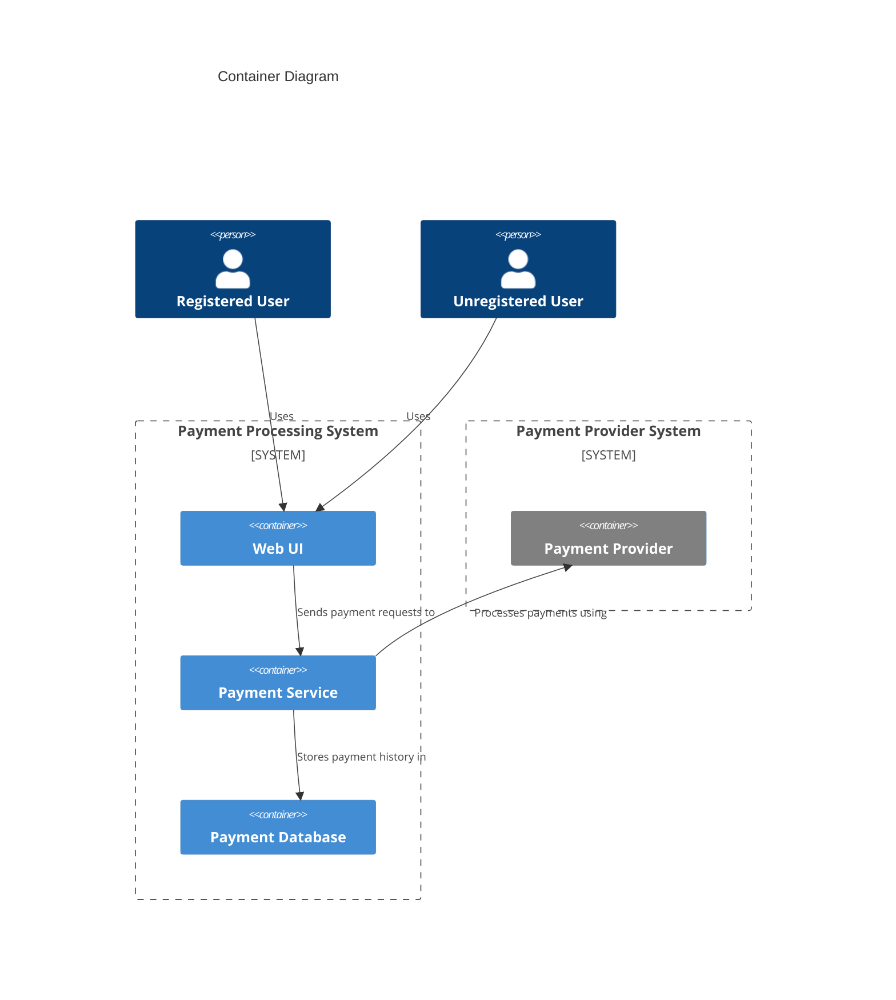

# AI-generated-system
AI generated system. We are not going to write the code or draw. Only chatting with AI =)

## Functional requirements

The system should be able to manage users who wants pay their bills or give ability to pay without registartion

The mayment should be sent to a service provider via available payment system (such as easy pay, paypal, etc)

System should take care about payment process (make retries if needed, notify if payment provider is unavailable) and continue process if it was failed in the middle (be relyable)

For registred users sustesm should save a history of payments

System should have web UI, backend service/services and relation database

please suggest the architecture. Draw the container C4 diagram using mermaid

## Design proposal
// C4 Level 1: Context Diagram

### 1. Web UI (UserInterface)
**Technology:** React\
**Explanation:** The Web UI is the frontend application built using the React library. Both registered and unregistered users interact with this component to initiate and manage payment requests.\
### 2. Payment Service (BackendService - Spring Boot)
**Technology:** Java with Spring Boot\
**Explanation:** The Payment Service represents the backend of the payment processing system. Implemented using Java with the Spring Boot framework, it receives payment requests from the Web UI, processes them, interacts with the Payment Provider, stores payment history in the database, and manages the overall payment workflow.\
### 3. Payment Database (Database - PostgreSQL)
**Technology:** PostgreSQL\
**Explanation:** The Payment Database is a PostgreSQL database used to store payment-related data. This includes user registration information, payment history, and any other data necessary for the functioning of the payment processing system. The database is accessed by the Payment Service (implemented with Spring Boot) to read and write data.\
### 4. Payment Provider (PaymentProvider)
**Explanation:** The Payment Provider represents an external system that handles actual payment processing. This could be a third-party service such as PayPal or Easy Pay. The Payment Service (implemented with Spring Boot) communicates with the Payment Provider to process payments, and this interaction is crucial for the overall functioning of the payment processing system\
