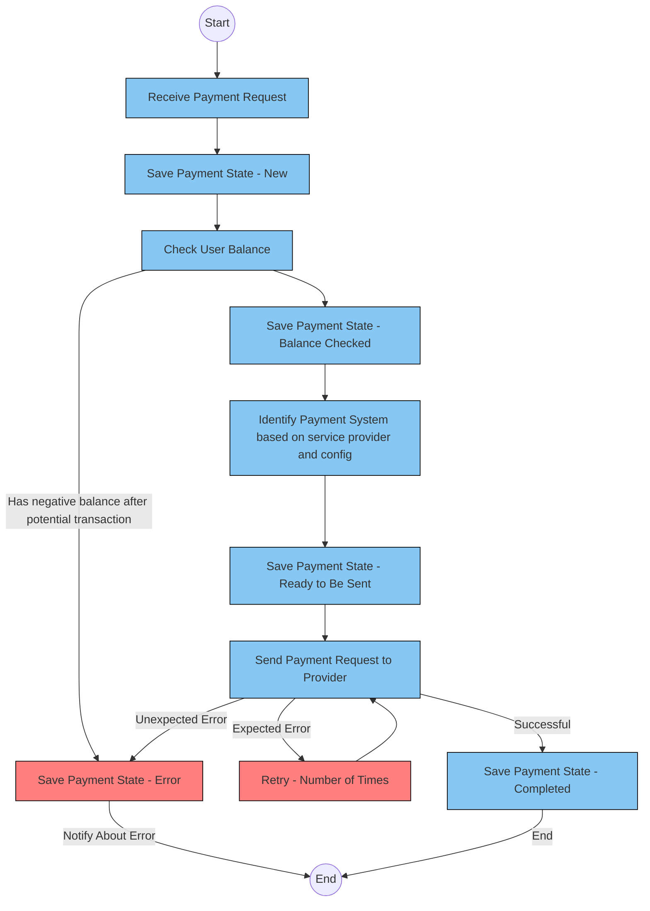

## Flow

	1. Receive Payment Request: Upon receiving and validating a payment request, the system proceeds to save the payment state as “New.” 
	2. Save Payment State - New: The system saves the payment state as “New” and then checks the user’s balance. 
	3. Check User Balance: The system verifies if the user has a sufficient balance for the payment. 
	4. Save Payment State - Balance Checked: After checking the user’s balance: 
	  • If the balance is positive, the payment state is saved as “Balance Checked.” 
	  • If the balance is not positive, the system saves it as an error and goes to the end of the flow. 
	5. Identify Payment System based on service provider and config: Using the service provider and configuration information, the system identifies the appropriate payment system and saves the payment state as “Ready to Be Sent.” 
	6. Save Payment State - Ready to Be Sent: The system is now prepared to send the validated payment request to the identified provider. 
	7. Send Payment Request to Provider: The system attempts to send the payment request to the provider, and the subsequent steps depend on the outcome: 
	  • Expected Error: If an expected error occurs during the sending process, the system retries a certain number of times. 
	  • Retry - Number of Times: The system retries sending the payment request to the provider. 
	  • Unexpected Error: In case of an unexpected error during the sending process or if the number of retries was succeeded, the system saves the payment state as “Error.” 
	  • Save Payment State - Error: The system saves the payment state as “Error” and notifies about the error. 
	  • Notify About Error: The system notifies relevant parties about the error. 
	  • Successful: If the payment request is successfully processed by the provider, the system saves the payment state as “Completed.” 
	  • Save Payment State - Completed: The system saves the payment state as “Completed” after a successful transaction. 
