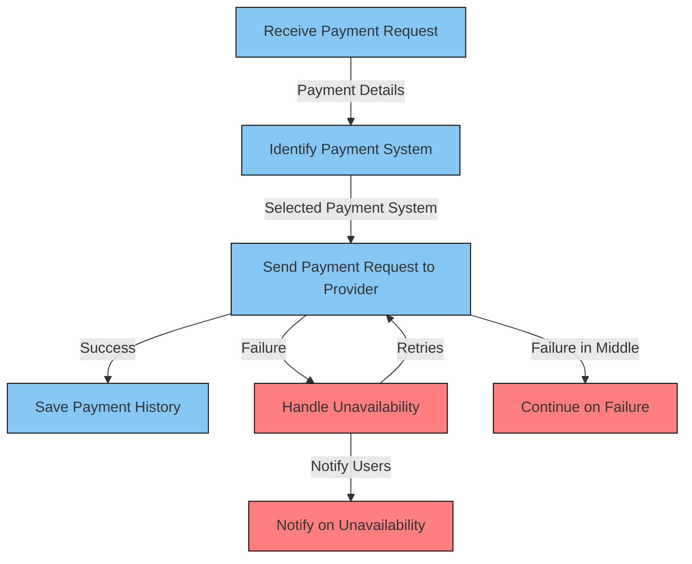

## Flow

	1.	Receive Payment Request:
	•	Accept payment requests from users.
	2.	Identify Payment System:
	•	Determine the appropriate payment system (e.g., Easy Pay, PayPal) based on the payment details.
	3.	Send Payment Request to Provider:
	•	Forward the payment request to the selected payment service provider.
	4.	Handle Unavailability:
	•	Implement a mechanism to handle cases where the payment provider is unavailable.
	•	Make retries with exponential backoff to increase the chances of success.
	5.	Notify on Unavailability:
	•	Notify users if the payment provider remains unavailable after multiple retries.
	6.	Continue on Failure:
	•	Ensure the system can recover and continue processing payments even if a failure occurs in the middle.
	•	Log and monitor failures for later analysis.
	7.	Save Payment History:
	•	For registered users, maintain a history of payments in a secure and reliable database.
	•	Include details such as payment amount, timestamp, payment status, and any relevant metadata.
	8.	Retry Mechanism:
	•	Implement a robust retry mechanism for failed payments to maximize success rates.
	9.	Notification System:
	•	Establish a notification system to inform users about the status of their payments.
	•	Notify users of successful payments or any issues encountered during the payment process.
	10.	Security Measures:
	•	Ensure the security of sensitive payment information.
	•	Use encryption and secure communication protocols.
	11.	Monitoring and Analytics:
	•	Implement monitoring and analytics tools to track the performance of the payment service.
	•	Analyze payment trends, success rates, and failure patterns for continuous improvement.
	12.	Compliance:
	•	Ensure compliance with relevant regulations and standards in the payment processing industry.
